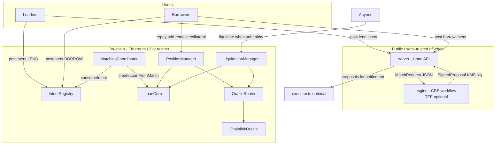

# PrivaLend

**PrivaLend** is a privacy-oriented lending protocol and matching stack built for ETHPrague 2026 Hackathon. The idea is to separate **public commitment** (what users are willing to do, expressed as on-chain intents and eventual loans) from **private negotiation** (interest rates and matching logic that can run inside a trusted execution environment so raw bids are not visible to a central database or the public mempool in the same form).

This repository contains:

1. **Solidity contracts** (Foundry) — a modular on-chain core: intent book, batched matching with digest approval, multi-lender loans, collateral health, and liquidation.
2. **Matching engine** (TypeScript) — a deterministic, pure function that turns lend/borrow intent batches into **proposals**, optionally decrypting ECIES-protected rates when a private key is available (intended for **Chainlink CRE** / TEE workflows).
3. **HTTP server** (Hono) — a thin **intent pool** and epoch tick that forwards batches to the CRE workflow and stores **KMS-signed proposals** for downstream settlement.

The sections below walk through the **whole logic** end to end: economics, trust boundaries, each contract, and how the off-chain pieces relate.

---

## Table of contents

- [Problem and design goals](#problem-and-design-goals)
- [High-level architecture](#high-level-architecture)
- [End-to-end lifecycle](#end-to-end-lifecycle)
- [On-chain domain model](#on-chain-domain-model)
- [Contract reference](#contract-reference)
  - [Libraries and shared types](#libraries-and-shared-types)
  - [Access control](#access-control)
  - [IntentRegistry](#intentregistry)
  - [MatchingCoordinator](#matchingcoordinator)
  - [LoanCore](#loancore)
  - [PositionManager](#positionmanager)
  - [LiquidationManager](#liquidationmanager)
  - [Oracle stack](#oracle-stack)
  - [Mocks (tests)](#mocks-tests)
- [Off-chain components](#off-chain-components)
- [Trust and privacy model](#trust-and-privacy-model)
- [Important implementation notes](#important-implementation-notes)
- [Development and deployment](#development-and-deployment)
- [Repository layout](#repository-layout)

---

## Problem and design goals

Traditional order books or lending pools often expose **standing interest rates** or full **order visibility**. For institutional or retail users who care about **information leakage**, a useful pattern is:

- Publish **size and shape** of willingness to trade (token pair, max size, collateral ratio bounds, expiry) **without** publishing the exact rate to the world in cleartext on a public server.
- Run **matching** where rates are decrypted only inside an environment that is not the public API database (e.g. a TEE-backed workflow).
- Still land a **single coherent loan** on-chain with **clear invariants** (who lent how much, what collateral is locked, what health factor means).

PrivaLend’s on-chain design adds another wrinkle: a **borrower can be filled by multiple lenders** in one execution, with a **principal-weighted blended rate** enforced against each lender’s floor rate and the borrower’s ceiling rate.

---

## High-level architecture



- **IntentRegistry** holds durable **intents**; only the configured **MatchingCoordinator** can consume liquidity from an intent.
- **MatchingCoordinator** implements **epochs**: open window for registering **match digests**, then finalize; only then may the matcher **execute** a previously registered digest once (replay protection via digest and borrower nonce).
- **LoanCore** is the **custodian** of principal and collateral (ERC-20 transfers), tracks **multi-lender** positions, routes repayments into **per-lender claimable balances**, and exposes restricted hooks to the coordinator, position manager, and liquidation manager.
- **PositionManager** and **LiquidationManager** are **policy shells** around `LoanCore`: borrower-facing repay/add/remove collateral with **oracle-based health checks**, and liquidator-facing **partial liquidations** with a **bonus** and **close factor**.

---

## End-to-end lifecycle

### 1. Users express intent

**On-chain (canonical for the modular system):**

- A **lender** calls `IntentRegistry.postIntent(LEND, token, collateralToken, maxAmount, rateBps, minCollateralRatioBps, expiry)`.
  - For lend intents, `minCollateralRatioBps` is unused in the registry validation path for LEND side in the same way as borrow; matching enforces token/collateral consistency.
- A **borrower** calls `postIntent(BORROW, ...)` with `minCollateralRatioBps >= 10_000` (i.e. at least **100%** collateralization expressed as collateral value vs debt value at match time is enforced later via **PositionManager** / **LiquidationManager** using the oracle).

Each intent gets a deterministic `intentId` (hash over maker, side, tokens, amounts, rate, ratio, expiry, nonce, chain id, registry address).

**Off-chain (demo / CRE path):**

- The **server** accepts JSON lend/borrow records with **ECIES ciphertexts** (or plaintext decimals in dev) for rates and stores them in memory.
- A cron job bundles eligible intents and POSTs them to `CRE_WORKFLOW_URL`, which runs the **engine** and returns **signed proposals**.

### 2. Matcher plans a match (off-chain or operator tooling)

For the modular contracts, the matcher (or a builder script) computes:

- `MatchExecutionParams`: epoch, borrow intent id, borrower, tokens, principal, collateral amount, **weightedRateBps**, **minCollateralRatioBps**, duration, **borrowerNonce**, **salt**.
- Arrays: `lendIntentIds[]`, `lenders[]`, `amounts[]` that sum to `principal`.

Then `digest = MatchingCoordinator.computeMatchDigest(...)`.

### 3. Epoch gate (on-chain)

1. Owner calls `openEpoch()` → new monotonic `epochId`, epoch marked **open**.
2. Matcher calls `registerMatchDigest(epochId, digest)` for each approved batch match plan while the epoch is open.
3. Owner calls `finalizeEpoch(epochId)` → epoch **closed**; execution is now allowed for that epoch.

This creates an explicit **two-phase** process: **register** digests under time/order control of the owner, then **settle** matches only against the frozen digest set.

### 4. Execution (on-chain)

Matcher calls `executeMatch(params, lendIntentIds, lenders, amounts)`:

- Verifies epoch is **finalized** and not still “open” in the invalid sense checked in code.
- Verifies `digest` was registered and not previously consumed; verifies **borrower nonce** not reused across matches for that borrower.
- **`IntentRegistry.consumeIntent`** on the borrow intent for full `principal`, and on each lend intent for its slice; checks **sides**, **makers**, **tokens**, and **rate constraints**:
  - Blended **weightedRateBps** must be **≤** borrower’s max `rateBps`.
  - Blended rate must be **≥** each lender’s own `rateBps` (each lender gets at least their floor).
- **`LoanCore.createLoanFromMatch`** pulls loan tokens from each lender to the borrower, pulls collateral from borrower into `LoanCore`, records the loan as **ACTIVE**, sets `dueTimestamp` (default **30 days** if duration is zero).

### 5. Servicing and unwind

- **Borrower** repays via `PositionManager.repay` → `LoanCore.repayFromPositionManager` distributes to **lender claim buckets** pro-rata by initial principal share (rounding dust to the first lender).
- **Borrower** can **add** collateral anytime; **remove** collateral only if post-withdrawal **health factor** (oracle) remains **≥** loan’s `minCollateralRatioBps`.
- When **health** falls below `minCollateralRatioBps`, **anyone** can call `LiquidationManager.liquidate` with up to **close factor** of outstanding debt, pay debt token, receive collateral with a **liquidation bonus**, and have principal reduced via the same distribution path as repay.

### 6. Claims

- Lenders call `LoanCore.withdrawClaim(loanId)` to pull their share of repaid or liquidation-paid **loan token** from the contract balance.

---

## On-chain domain model

Core structs live in `contracts/src/libraries/Types.sol`:

| Concept | Role |
|--------|------|
| **Intent** | Maker’s standing instruction: side (LEND/BORROW), token pair, remaining size, rate floor/ceiling in **bps**, min collateral ratio for borrows, expiry, nonce, active flag. |
| **Loan** | Single borrower, many lenders implied via `lenderPrincipalByLoan`; tracks outstanding principal, locked collateral, weighted rate bps, min health ratio bps, timestamps, `LoanStatus`. |
| **MatchExecutionParams** | Canonical scalar bundle for hashing and execution: ties one borrow fill to many lend fills with one collateral amount and blended rate. |

**LoanStatus** values: `NONE`, `ACTIVE`, `REPAID`, `LIQUIDATED`, `DEFAULTED`.  
`markDefault` is an **owner-only** escape hatch after `dueTimestamp` for loans that are still marked active (governance / ops), distinct from user-driven repay or liquidation.

---

## Contract reference

Paths are under `contracts/src/` unless noted.

### Libraries and shared types

- **`libraries/Types.sol`** — `IntentSide`, `LoanStatus`, `Intent`, `Loan`, `MatchExecutionParams`.
- **`libraries/Errors.sol`** — Custom errors used across modules (`Unauthorized`, `Replay`, `HealthFactorOk`, oracle errors, etc.).

### Access control

- **`access/OwnerRoles.sol`** — Used by `IntentRegistry` and `MatchingCoordinator`: `owner` plus `isMatcher` for matcher-only functions (`registerMatchDigest`, `executeMatch`).
- **`access/OwnableLite.sol`** — Minimal `owner` for oracle routers, Chainlink adapter, `PositionManager`, `LiquidationManager`.

### IntentRegistry

**File:** `IntentRegistry.sol`  
**Inherits:** `OwnerRoles`

**Responsibilities:**

- Per-user **nonce** and deterministic **`intentId`** generation.
- Stores full **`Intent`** struct; exposes `intentOf`.
- **`postIntent`**: validates addresses, positive size, future expiry; for **BORROW** enforces `minCollateralRatioBps >= 10_000`.
- **`cancelIntent`**: maker can deactivate.
- **`consumeIntent`**: **only** `matchingCoordinator`; decrements `remainingAmount`, deactivates when depleted; enforces active, non-expired, sufficient remainder.

**Wiring:** `setMatchingCoordinator` (owner) — must point at the live `MatchingCoordinator`.

### MatchingCoordinator

**File:** `MatchingCoordinator.sol`  
**Inherits:** `OwnerRoles`

**Responsibilities:**

- **Epoch lifecycle** (`openEpoch`, `finalizeEpoch`) with strict state: cannot open a new epoch while the current one is still open; finalize only matches `currentEpochId`.
- **`registerMatchDigest`**: matcher records `keccak256(abi.encode(...))` of the full match tuple including lend intent id array, lender addresses, amounts, params, chain id, coordinator address.
- **`executeMatch`**: full validation + intent consumption + `LoanCore.createLoanFromMatch`.
- **Replay protection:** `consumedMatchDigest` and `consumedBorrowerNonce[borrower][nonce]`.

**Economic checks encoded here:**

- Borrow intent consumed must match `params` (borrower, tokens, principal).
- Sum of lend fills equals principal.
- Blended `weightedRateBps` ≤ borrower’s posted max `rateBps`.
- Blended `weightedRateBps` ≥ each lender’s `rateBps`.
- `minCollateralRatioBps` in params must be **≥** borrow intent’s minimum (borrower cannot be forced into looser collateral than they posted).

### LoanCore

**File:** `LoanCore.sol`  
**Inherits:** `OwnerRoles` (owner configures allowlists)

**Responsibilities:**

- **`createLoanFromMatch`** (only `isCoordinator`): validates distinct non-zero lenders, pulls **loan token** from each lender to borrower, pulls **collateral** from borrower into this contract, initializes loan state, emits `LoanCreated`.
- **`repayFromPositionManager`** / **`addCollateralFromPositionManager`** / **`removeCollateralToBorrower`**: only `PositionManager`; updates balances and transfers.
- **`applyLiquidation`**: only `LiquidationManager`; liquidator pays debt token in, repayment is distributed like a repay, collateral sent to liquidator, status may become `LIQUIDATED` when principal or collateral hits zero.
- **`_distributeRepayment`**: for each lender, `share = amount * lenderPrincipal / loan.principal`; remainder after integer division goes to **first lender** in the list.
- **`withdrawClaim`**: lenders pull **loan token** balances accrued from repayments/liquidations.

**Allowlists (owner-set):**

- `isCoordinator` — typically the `MatchingCoordinator` contract address.
- `isPositionManager` — `PositionManager`.
- `isLiquidationManager` — `LiquidationManager`.

### PositionManager

**File:** `PositionManager.sol`  
**Inherits:** `OwnableLite`

**Responsibilities:**

- Borrower-facing **`repay`**, **`addCollateral`**, **`removeCollateral`**, **`closePosition`** (full collateral pull after principal is zero).
- Uses **`IPriceOracle`** (`OracleRouter`) and **`IERC20Metadata`** to compute **health factor in basis points**: collateral value divided by debt value, scaled by 10,000, with both sides valued using oracle feeds and token decimals normalized inside the function.

**Remove collateral rule:** projected HF after withdrawal must stay **≥** `loan.minCollateralRatioBps`.

### LiquidationManager

**File:** `LiquidationManager.sol`  
**Inherits:** `OwnableLite`

**Parameters (owner-configurable):**

- **`closeFactorBps`** — max fraction of outstanding principal one call can close (default **50%**).
- **`liquidationBonusBps`** — extra collateral awarded to liquidator atop the fair swap at oracle prices (default **5%**), capped by validation at **≤ 50%** to avoid absurd configs.

**`liquidate(loanId, requestedRepayAmount)`:**

- Reverts if loan not `ACTIVE` or HF **≥** `minCollateralRatioBps` (`HealthFactorOk`).
- Clamps repay to **close factor** and outstanding principal.
- Converts repaid debt value to collateral units at oracle prices, applies **bonus**, caps by on-chain collateral balance, then calls `LoanCore.applyLiquidation`.

### Oracle stack

- **`interfaces/IPriceOracle.sol`** — `getPrice(token) → (price, updatedAt)` with price normalized to **8 decimals** in the Chainlink implementation’s return value convention used by downstream math (managers divide/multiply consistently with `1e8`).

- **`oracle/ChainlinkOracle.sol`** — Owner maps each token to a **Chainlink AggregatorV3** feed and `maxStaleness`. Rejects zero/negative answers and stale `updatedAt`.

- **`oracle/OracleRouter.sol`** — Optional **manual price** per token, **pause** flag per token, or passthrough to **`primaryOracle`** (typically `ChainlinkOracle`). Lets ops override feeds in emergency or test scenarios without redeploying core logic.

**Important:** `PositionManager` and `LiquidationManager` each hold their own `oracle` reference (set in constructor / `setOracle`). Keep them aligned in production.

### Mocks (tests)

- **`mocks/MockERC20.sol`**, **`mocks/MockChainlinkFeed.sol`** — Used in Forge tests to simulate transfers and oracle moves (e.g. sudden collateral price drop to trigger liquidation).

---

## Off-chain components

### `engine/` — Matching engine and CRE workflow

- **`engine.ts`** — **Pure** matching: sort borrows by size descending, lends by rate ascending, greedily fill each borrow from compatible lends (same loan `token`), track remaining per `lendIntentId`, compute **principal-weighted average** rate for the borrow; **reject** the partial fill if blended rate **>** borrower’s max rate (rolls back remainder to lenders for that borrow).
- **`ecies.ts`** — Decrypts rate ciphertexts with `eciesjs` when `CRE_PRIVATE_KEY` is present; optionally accepts **plaintext** decimal rates in `(0, 1)` for local dev when fallback is allowed.
- **`canonical.ts`** — `canonicalEncode` + `proposalHash` (**keccak256**) over a stable JSON shape so verifiers (or future on-chain code) can pin **exactly** what was signed.
- **`main.ts`** — Chainlink **CRE** `Runner`: HTTP trigger parses `MatchRequest`, runs engine, signs each proposal hash with **KMS** (Orbitport) or **fallback** local key from secrets, returns `MatchResponse` with `SignedProposal[]`.

### `server/` — Intent pool and epoch tick

- REST-style routes: post lend/borrow intents, cancel, list proposals.
- **`runEpoch`**: builds `MatchRequest` from pending borrows and lends **not** locked by another pending proposal’s ticks, POSTs to **`CRE_WORKFLOW_URL`**, stores signed proposals with TTL (pending proposals expire on a short cadence).
- **`executor.ts`**: separate process that polls proposals and calls a **`settleMatch`** ABI on **`POOL_ADDRESS`** — this targets a **monolithic pool-style contract** not present in this repo’s `contracts/src` tree. Treat it as a **compatibility stub** or future wiring; the **modular** on-chain path settles via **`MatchingCoordinator.executeMatch`** after digest registration, not via `settleMatch`.

### `client-snippets/`

- Example **`encryptRate`** using `eciesjs` and a CRE public key for browser or CLI clients submitting intents to the server.

---

## Trust and privacy model

| Layer | What is hidden / protected | What is trusted |
|--------|---------------------------|-----------------|
| **Public server DB** | Ideally **not** storing plaintext rates if clients submit ECIES ciphertexts only. | Server still sees sizes, addresses, token addresses, collateral amounts. |
| **CRE / TEE** | Rates decrypted **only** inside the workflow enclave for matching; KMS key used to sign proposal digests. | Trust in CRE host, KMS policy, and that binary matches audited source. |
| **On-chain** | Intents and loans are **fully public** once posted/settled. | **Matcher** is trusted for liveness and correct digest registration; **owner** controls matcher role, epoch transitions, oracle overrides; **oracle** correctness drives liquidations and collateral withdrawal safety. |

The protocol does **not** remove the need for borrowers and lenders to trust **token contracts**, **oracle feeds**, and **governance** of allowlisted addresses.

---

## Important implementation notes

1. **Interest accrual:** `weightedRateBps` is enforced at match time and stored on the loan for metadata and future extension; **`DEPLOYMENT_CHECKLIST.md`** notes that **on-chain interest accrual is not implemented yet** — principal does not grow over time from interest in the current `LoanCore` code.

2. **Rate units:** On-chain intents use **basis points** (100 bps = 1%). The TypeScript engine uses **decimal fractions in `(0, 1)`** (e.g. `0.05` for 5%). Any production bridge from **SignedProposal** to **`executeMatch`** must convert consistently.

3. **Intent IDs:** On-chain `intentId` is **`bytes32`**. Server/engine use **UUID strings** for lend/borrow records in the demo API — binding those worlds requires an explicit mapping strategy (e.g. hash commitments, or storing chain `intentId` after `postIntent`).

4. **Executor vs modular contracts:** Running `server/src/executor.ts` against **`MatchingCoordinator`** requires a new ABI adapter; it is **not** a drop-in for the current Forge modules without additional Solidity or script glue.

---

## Development and deployment

### Prerequisites

- **Foundry** (`forge`, `cast`, `anvil`) for Solidity.
- **Bun** or **Node** for `engine` and `server` (see each package’s `package.json`).

### Contracts — test

```bash
cd contracts
forge test
```

Key integration test: `test/IntentToLiquidationFlow.t.sol` — posts intents, opens/finalizes epoch, registers digest, executes match, drops collateral price, liquidates partially, repays remainder, closes position.

### Contracts — deploy script

`contracts/script/Deploy.s.sol` deploys the modular stack and wires roles. Required environment variables are documented in `contracts/DEPLOYMENT_CHECKLIST.md` (e.g. `PRIVATE_KEY`, `MATCHER_ADDRESS`, token and feed addresses, `MAX_ORACLE_STALENESS`, optional liquidation params).

Example invocation pattern (adjust RPC and broadcast flags for your network):

```bash
cd contracts
forge script script/Deploy.s.sol:Deploy --rpc-url "$RPC_URL" --broadcast
```

### Engine and server

- Configure **`CRE_WORKFLOW_URL`** on the server to point at the deployed CRE HTTP trigger.
- Provide secrets per **`engine/src/main.ts`** (`CRE_PRIVATE_KEY` or KMS + Orbitport auth for production signing).

---

## Repository layout

| Path | Purpose |
|------|---------|
| `contracts/src/` | All production Solidity: core, oracles, interfaces, access, libraries. |
| `contracts/script/` | Forge deployment scripts. |
| `contracts/test/` | Forge tests demonstrating flows and edge invariants. |
| `engine/` | CRE workflow package: matching, ECIES, canonical hash, signers. |
| `server/` | Hono API, epoch tick, optional executor for a pool-style ABI. |
| `client-snippets/` | Reference encryption snippet for rates. |

---

## Disclaimer

This software is **experimental**. It has **not** been professionally audited. Do not deploy with real funds without independent security review, economic modeling, and operational runbooks. Oracle manipulation, malicious matchers, and upgrade/governance mistakes are all in scope for real-world threats.

---

*If you extend the project, consider updating this README when you add interest accrual, chain intent ID binding in the server, or a unified settlement contract that verifies KMS-signed digests on-chain.*
